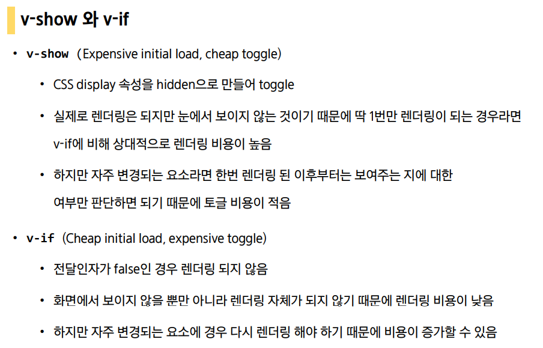
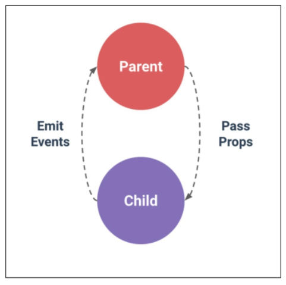

# Vue.js

> Vue.js는 대표적인 프론트엔트 프레임워크로 사용자에게 데이터를 눈으로 볼 수 있고 상호작용 할 수 있도록 돕는다. 
>
> 사용자 인터페이스를 만들기 위한 프로그레시브 프레임워크로 현대적인 tool과 다양한 라이브러리를 통해 SPA(single page aplication)을 지원한다.
>
> SPA란 현재 페이지를 동적으로 작성함으로써 사용자와 소통하는 웹 애플리케이션이며 단일 페이지로 구성되며 서버로부터 페이지를 받아온 후 동적으로 DOM을 구성한다.
>
> SPA는 스마트폰의 등장으로 모바일 최적화에 대한 필요성이 생겼고 요청에 따라 매번 새로운 페이지를 응답하는 것이 아닌 모바일 네이티브 앱과 같은 형태의 웹 페이지이다. 즉, 1개의 페이지 내에서 여러 동작이 이뤄지는 형태이다. 
>
> | CSR(client side rendering)                                   | SSR(server side rendering)                                   |
> | ------------------------------------------------------------ | ------------------------------------------------------------ |
> | 최초 요청 시 서버에서 빈 문서를 응답하고 이후 클라이언트에서 데이터를 요청해 데이터를 받아 DOM을 렌더링하는 방식 | 서버에서 사용자에게 보여줄 페이지를 모두 구성하여 보여주는 방식 |
> | SSR보다 초기 전송 페이지 속도는 빠르지만 서비스에 필요한 데이터를 추가로 요청하여 재구성해야 하기 때문에 전체적인 페이지 완료 시점은 SSR보다 느리다. | CSR보다 페이지 구성 속도는 느리지만 사용자에게 보여주는 콘텐츠 구성이 완료되는 시점은 빠르다. |
> | 장점 : 서버와 클라이언트 간 트래픽 감소(모든 정적 리소스를 최초 한번만 다운), 사용자 경험 향상(전체 페이지 렌더링 않고 변경 부분만 갱신) | 장점 : 초기 로딩 속도가 빠르기 때문에 사용자가 콘텐츠를 빨리 볼 수 있고 SEO가 가능하다. |
> | 단점 : SEO(검색엔진 최적화 - 검색엔진이 자료를 수집하고 순위를 메겨 검색 결과 상위에 노출되도록 하는 작업으로 컨텐츠의 신뢰도 파악 지표로 활용) 문제가 발생할 수 있음 | 단점 : 모든 요청에 새로고침이 되므로 사용자 경험이 떨어지고 요청 횟수가 많이 서버 부담이 커진다. |

<br>

**Vanilla.js**

웹 페이지가 커짐에 따라 사용하는 데이터도 늘어나고 상호작용도 많이 이뤄지므로 Vanilla.js만으로 관리하기 어렵다. 

vanilla.js는 변경사항이 있다면 '모든 요소'를 선택해서 '이벤트'를 등록하고 값을 변경해야 하므로 DOM과 data가 연결되어 data만 변경하면 되는 Vue.js를 사용한다. 

<br>

## Vue.JS

### MVVM Pattern

애플리케이션 로직을 UI로부터 분리하기 위해 설계된 디자인 패턴

- Model(JavaScript Object 자료 구조)
- View(DOM(HTML), Data의 변화에 따라 바뀌는 대상)
- View Model (DOM과 Data의 중개자, 모든 Vue Instance)

<br>

### Vue instance

```vue
<div id='app'>
    <button @click='myFun'>a</button>
    <button @click='yourFun'>a</button>
</div>

<script>
cosnt app = new Vue({  // 새로운 인스턴스 생성
	el: '#app',  // 인스턴스에 연결할 기존 DOM 엘리먼트가 필요
	data: {  // *data
		message: 'Hello',
	},
	methods: {  // *methods
		greeting : function () {
			console.log('hello')
		},
        myFun : function () {
            console.log(this)  // Vue instance
        }, 
        yourFun : () => {
            console.log(this)  // window
        }
	}
})
</script>
```

##### data

- Vue 인스턴스 데이터 객체
- Vue 앱의 상태 데이터를 정의하는 곳
- Vue template에서 interpolation을 통해 접근 가능
- v-bind, v-on과 같은 디렉티브에서도 사용 가능
- Vue 객체 내 다른 함수에서 this 키워드를 통해 접근 가능
- **화살표 함수가 부모 컨텍스트를 바인딩하기 때문에 , `this`는 예상과 달리 Vue 인스턴스를 가리키지 않음**

##### methods

- Vue 인스턴스에 추가할 메서드
- Vue template에서 interpolation을 통해 접근 가능
- v-on과 같은 디렉티브에서도 사용 가능
- Vue 객체 내 다른 함수에서 this 키워드를 통해 접근 가능
- **화살표 함수가 부모 컨텍스트를 바인딩하기 때문에, `this`는 Vue 인스턴스가 아니며 `this.a`는 정의되지 않음**

<br>

### Template Syntax

#### Interpolation (보간법)

1. Text

   `<span> 메세지 : {{ msg }}</span>`

2. Raw HTML 

   `<span v-html="rawHtml"></span>`

3. Attributes 

   `div v-bind:id="dynamicId">`

4. JS 표현식 

   `{{ number + 1 }}`

   `{{ message.split('').reverse().join('') }}`

#### Directive (디렉티브)

##### 1. v-text

- 엘리먼트의 textContent를 업데이트
- 내부적으로 interpolation 문법이 v-text로 컴파일 됨

##### 2. v-html

- 엘리먼트의 innerHTML을 업데이트 (XSS 공격에 취약할 수 있음)
- 임의로 사용자로부터 입력 받은 내용은 v-html에 ‘절대’ 사용 금지

##### 3. v-show

- 조건부 렌더링
- 엘리먼트는 항상 렌더링 되고 DOM에 남아있음
- 단순히 엘리먼트에 display CSS 속성을 토글

##### 4. v-if, v-else-if, v-else

- 조건부 렌더링
- 디렉티브의 표현식이 true 일때만 렌더링
- 엘리먼트 및 포함된 디렉티브는 토글하는 동안 삭제되고 다시 작성됨



##### 5. v-for

-  원본 데이터를 기반으로 엘리먼트 또는 템플릿 블록을 여러 번 렌더링(item in items 구문 사용)
- item 위치의 변수를 각 요소에서 사용할 수 있음(객체의 경우 key)
- v-for 사용시 반드시 key 속성을 각 요소에 작성
- v-if보다 우선순위가 높음(가능하면 동시에 사용하지 말것)

##### 6. v-on

- 엘리먼트에 이벤트 리스너를 연결, 이벤트 유형은 전달인자(:)로 표시
- 특정 이벤트가 발생했을 때, 코드가 실행됨
- `v-on:click → @click`

##### 7. v-bind

- HTML 요소의 속성에 Vue의 상태 데이터를 값으로 할당
- Object 형태로 사용하면 value가 true인 key가 class 바인딩 값으로 할당
- `v-bind:href → :href`

##### 8. v-model

- HTML form 요소의 값과 data를 양방향 바인딩
- .lazy(input 대신 change 이벤트 이후에 동기화), .number (문자열을 숫자로 변경), .trim (입력에 대한 trim을 진행)

<br>

#### Options/Data – ‘computed’

```vue
<body>
    <div>
        <p>{{ num }}</p>
        <p>{{ doublenum }}</p>
    </div>
</body>

<script>
	const app = new Vue({
        el:'#app',
        data: {
            num:2,
        },
        computed: {
            doublenum: function () {
                return this.num * 2
            }
        }
    })
</script>
```

- 데이터를 기반으로 하는 계산된 속성
- 함수의 형태로 정의하지만 함수가 아닌 함수의 반환 값이 바인딩 됨
- 종속된 대상을 따라 저장(캐싱) 됨
- 종속된 대상이 변경될 때만 함수를 실행 (즉, Date.now() 처럼 아무 곳에도 의존하지 않는 computed 속성의 경우 절대로 업데이트되지 않음)
- 반드시 반환 값이 있어야 함

> computed & method
>
> computed는 종속된 대상이 변경되지 않는 한 computed에 작성된 함수를 여러 번 호출해도 계산을 다시 하지 않고 계산되어 있던 결과를 반환한다.(종속 대상을 따라 저장)
>
> methods를 호출하면 렌더링을 다시 할 때마다 항상 함수를 실행한다.

<br>

#### Options/Data – ‘watch’

- Options/Data – ‘watch’

> computed & watch
>
> computed는 특정 값이 변동하면 특정 값을 새로 계산해서 보여준다. 즉, 특정 데이터를 직접적으로 사용/가공하여 다른 값으로 만들 때 사용하며 속성은 계산해야 하는 목표 데이터를 정의하는 방식으로 소프트웨어 공학에서 이야기하는 ‘선언형 프로그래밍’ 방식이다.
>
> watch는 특정 값이 변동하면 다른 작업을 한다. 즉, 특정 데이터의 변화 상황에 맞춰 다른 data 등이 바뀌어야 할 때 주로 사용하며 특정 데이터의 변화 상황에 맞춰 다른 data 등이 바뀌어야 할 때 주로 사용한다. 
>
> computed가 코드 반복이 적은 등 우수하다고 평가하는 경향이 있음

<br>

#### Options/Assets – ‘filters’

- 텍스트 형식화를 적용할 수 있는 필터

- interpolation 혹은 v-bind를 이용할 때 사용 가능, 체이닝 가능

- 필터는 자바스크립트 표현식 마지막에 “|” (파이프)와 함께 추가되어야 함

  - ```vue
    <p>{{ numbers | getOdd | doubleNum }}</p>
    ```

  - ```vue
    <script>
    	data : {
            numbers : [],
        }
        filters: {
            getOdd : function (nums) {
                const oddnums = nums.filter(function (num) {
                    return num % 2
                })
                return oddnums
            }
        }
    </script>
    ```

<br>

#### created 

- created 훅은 인스턴스가 생성된 후에 호출됨
- 이를 통해 애플리케이션 초기 데이터를 API 요청을 통해 불러올 수 있음

<br>

#### lodash

- 모듈성, 성능 및 추가 기능을 제공하는 JavaScript 유틸리티 라이브러리
- reverse, sortBy, range, random

<br>

<br>

## Component(컴포넌트)

> SFC(single file component)
>
> Vue의 컴포넌트 기반 개발의 핵심 특징
>
> 하나의 컴포넌트는 .vue라는 하나의 파일 안에서 작성되며 화면의 특정 영역에 대한 코드를 하나의 vue파일을 통해 개발하는 방식이다. 

<br>

## Vue CLI

> vue.js개발을 위한 표준 도구로서 프로젝트 구성을 도와주는 역할을 하며 vue 개발 생태계에서 표준 tool 기준을 목표로 한다. 

#### Node.js

Node.js란 자바스크립트를 브라우저가 아닌 환경에서도 구동할 수 있도록 하는 자바스크립트 런타임 환경

(NPM 자바스크립트 언어를 위한 패키지 관리자로 Python의 pip와 같은 역할)

##### Vue CLI 설치

```bash
$ npm install -g @vue/cli
$ vue --version
$ vue create (프로젝트 명)
$ npm run serve
```

<br>

#### Bable VS Webpack

- Bable 
  - 자바스크립트의 신버전 코드를 구버전으로 변환 해주는 도구
  - 자바스크립트는 파편화와 표준화의 영향으로 코드의 스펙트럼이 다양하기 때문에 버전별로 동작하지 않을 수 있고 원시코드를 목적 코드로 변환 가능하게 해준다. 
- Webpack
  - 모듈 간의 의존성 문제를 해결하기 위한 도구

<br>

#### 구조

- node_modules : node.js 환경의 여러 의존성 모듈
- public/index.html : vue 앱의 뼈대가 되는 html 파일
- src/assets : webpack에 의해 빌드된 정적 파일
- **src/components : 하위 컴포넌트들이 위치**
- **src/App.vue : 최상위 컴포넌트**
- src/main.js : vue 전역에서 활용할 모듈을 등록할 수 있는 파일로 실제 단일 파일에서 DOM과 data를 연결 했던 것과 동일한 작업이 이뤄진다. webpack이 빌드를 시작할 때 가장 먼저 불러오는 entry point
- bable.config.js : babel 관련 설정이 작성된 파일
- package.json : scripts(사용할 명령어 script), dependencies(개발, 배포 환경에서까지 활용할 모듈), devDependencies(개발 단계에서만 활용할 모듈)
- package-lock.json : 모듈과 관련해서 모든 의존성을 설정 및 관리, 개발 과정 간의 의존성 패키지 충돌 방지

<br>

### Pass Props & Emit Events

- 부모는 자식에게 데이터를 전달(pass props)하며, 자식은 자신에게 일어난 일을 부모에게 알림(emit events).



#### Props

- 상위 컴포넌트의 정보를 전달하기 위한 사용자 지정 특성
- 하위 컴포넌트는 props 옵션을 사용하여 수신하는 props를 명시적으로 선언해야 함
- 하위 컴포넌트의 탬플릿에서 상위 데이터를 직접 참조할 수 없음
- 단방향 바인딩으로 부모가 자식에겐 전달해도 반대는 안됨(부모 컴포넌트가 업데이트마다 자식 요소의 모든 props가 업데이트 됨)
- HTML : kebab-case, Script : camelCase 로 작성

<br>

#### Events

- 현재 인스턴스에서 이벤트를 트리거 `$emit(event)`, 추가 인자는 리스너의 콜백 함수로 전달
- 부모 컴포넌트는 자식 컴포넌트가 사용되는 탬플릿에서 v-on을 사용하여 자식 컴포넌트가 보낸 이벤트를 청취
- kebab-case

<br>

### Vue Router

> 라우팅의 결정권을 가지 vue.js에서 라우팅을 편리하게 할 수 있는 툴을 제공해주는 라이브러리

- router-link
  - index.js 파일에 정의한 경로에 등록한 특정한 컴포넌트와 매핑
  - 클릭 이벤트를 차단하여 브라우저가 페이지를 다시 로드하지 않도록 함
  - a 태그지만 기본 GET 요청을 보내는 이벤트를 제거한 형태로 구성
- router-view
  - 실제 컴포넌트가 DOM에 부착되어 보이는 자리를 의미
  - router-link를 클릭하면 해당 경로와 연결되어 있는 index.js에 정의한 컴포넌트가 위치

<br>

<br>

## Vuex

> 상태를 전역 저장소로 관리할 수 있도록 지원하는 라이브러리로 애플리케이션의 모든 컴포넌트에 대한 중앙 집중식 저장소 역할을 한다. 
>
> 중앙 저장소에 data(state)를 모아놓고 관리를 하기 때문에 규모가 큰 프로젝트에 매우 편리하며 각 컴포넌트에서는 중앙 집중 저장소의 state만 신경쓰면 된다. 이를 공유하는 다른 컴포넌트는 알아서 동기화가 된다. 

#### 단방향 데이터 흐름

- 상태(state)는 앱을 작동하는 원본 소스 (data)
- 뷰(view)는 상태의 선언적 매핑
- 액션(action)은 뷰에서 사용자 입력에 대해 반응적으로 상태를 바꾸는 방법 (methods)


<br>

#### 상태 관리 패턴

- 컴포넌트는 공유된 상태를 추출하고 이를 전역에서 관리 하도록 한다. 
- 모든 컴포넌트는 트리에 상관없이 상테에 엑세스 하거나 동작을 트리거 할 수 있다. 
- 상태 관리 및 특정 규칙 적용과 관련된 개념을 정의하고 분리함으로써 코드의 구조와 유지 관리 기능 향상

<br>

#### Vuex 구성 요소


**1. state**

중앙에서 관리하는 모든 상태 정보로 Mutations에 정의된 메서드에 의해 변경된다. 여러 컴포넌트 내부에 있는 특정 state를 중앙에서 관리하며 state가 변화하면 해당 state를 공유하는 컴포넌트의 DOM은 알아서 렌더링된다. 

- 컴포넌트는 Vuex Store에서 state 정보를 가져와 사용하게 된다
- `dispatch()`를 사용하여 Actions 내부의 메서드를 호출한다. 

<br>

**2. Actions**

컴포넌트에서 `dispatch()` 메서드에 의해 호출된다. Backend API와 통신하여 Data Fetching 등의 작업을 수행해 동기적인 작업 뿐만 아니라 비동기적인 작업을 포함 가능하다. 

항상 context가 인자로 넘어오지만 state를 직접 변경하지 않는다. 

- Mutations에 정의된 메서드를 `commit()` 메서드로 호출한다. 
- state는 Mutations 메서드를 통해서만 조작 가능하다. 

<br>

**3. Mutations**

- Actions에서 `commit() `메서드에 의해 호출된다. 
- 동기적인 코드만 작성한다.
- state를 변경하는 로직으로, mutations에 정의하는 메서드의 첫 번째 인자로 state가 넘어온다. 

<br>

**3. Getters**

state를 변경하지 않고 활용하여 계산을 수행한다. (=computed)

getteres 자체가 state 자체를 변경하지는 않고 특정한 조건에 따라 계산하여 값을 가져온다. 

